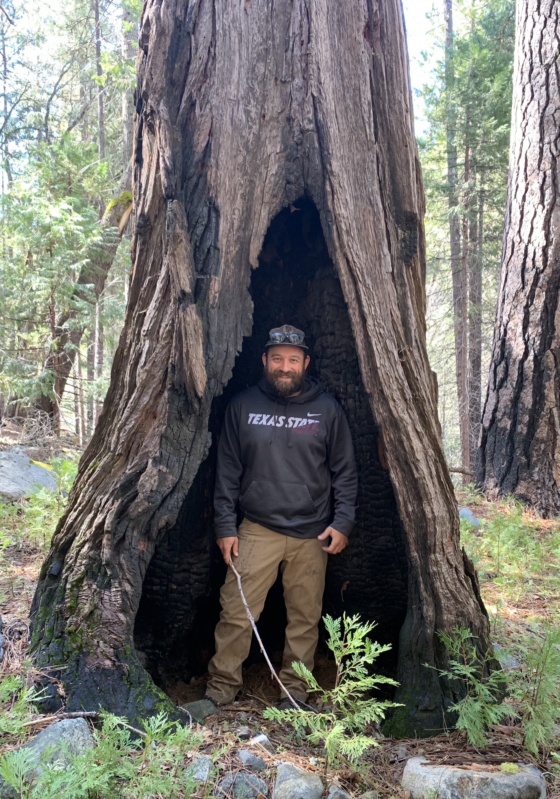

<h1>Members of the team!</h1>

<h3>Alex Sotola, PI</h3>

 

I am broadly trained as both a population geneticist and ecologist, with a strong background in bioinformatics and statistics. I work to understanding the myriad of genetic, ecological, and demographic factors that influence reproductive isolation (speciation). Specifically, my research program works to understand the genetic basis and ecological drivers of reproductive isolation, test the importance of barriers to gene flow, and assess the consequences of introgression by integrating population and quantitative genetics and ecological principals in tandem with field work and experimental approaches.

 
